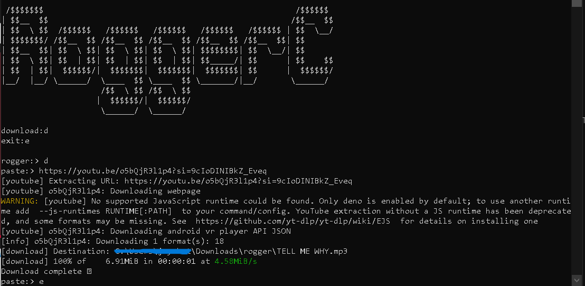
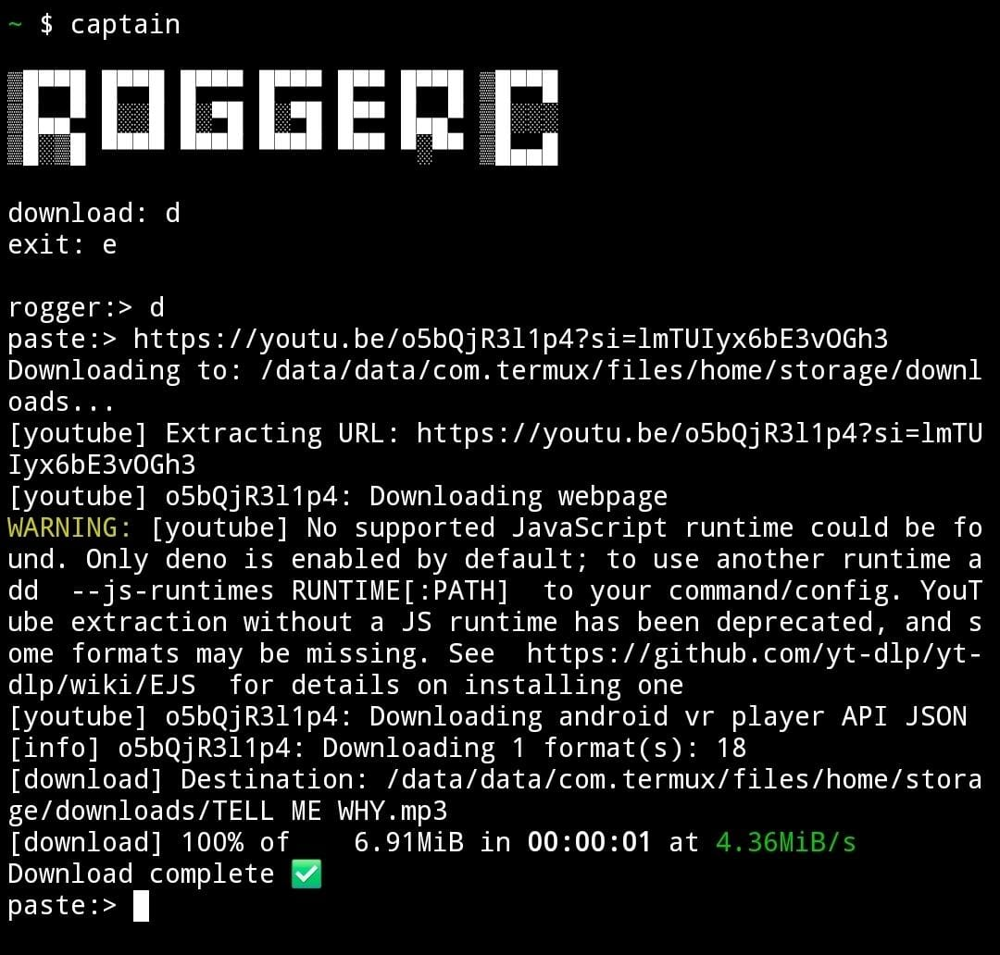

# 🎵 RoggerC

A **cross‑platform CLI-based MP3 downloader** that automatically adapts its behavior based on the platform you are using. Whether you run it on **Windows(needs venv)** or on **Android via Termux**,**also works on linux with venv** the tool intelligently adjusts storage paths, execution flow, and banner display to match the environment.

---

## ✨ Features

* 📦 **Platform-aware behavior**

  * Detects whether it is running on **Windows** or **Termux (Android)**
  * Automatically adjusts download directories according to the platform

* 🖥️ **Dynamic CLI Banner**

  * Displays different banners depending on the platform
  * Optimized for desktop terminals and mobile terminals

* ⚡ **Lightweight & Fast**

  * Simple CLI interface
  * No unnecessary dependencies

* 🎶 **MP3-focused Downloader**

  * Downloads and saves audio in MP3 format
  * Designed for ease of use from the command line

---

## 🧠 How It Works

* On **Windows**:

  * Detects the Windows OS
  * Uses Windows-compatible paths (e.g., Downloads or custom directories)
  * Displays a Windows-optimized CLI banner

* On **Android (Termux)**:

  * Detects the Termux environment
  * Adjusts storage paths to Termux-accessible directories
  * Displays a mobile-friendly CLI banner

---

## 🚀 Usage


## windows
```bash
git clone https://github.com/leovsiji/Roggerc.git
python -m venv ship
ship\scripts\activate
cd Roggerc\Roggerc
pip install -e .
captain  
```

## termux
```bash
git clone https://github.com/leovsiji/Roggerc.git
cd Roggerc/Roggerc
pip install -e .
captain 
```
press enter if the script pause on "captain"

Follow the on-screen CLI instructions to download MP3 files.

---

## 🖼️ Screenshots

### Windows CLI Execution



### Termux (Android) CLI Execution



#### ▶ How to Use the CLI MP3 Downloader

1. To start the program, type:
```bash
captain
```
2. When the menu appears, type:
```bash
d
```
3. paste a youtube link and the mp3 will download 
4. To exit the program at any time:

        Type 'e' at the paste link prompt, or
        Type 'e' at the rogger menu


---


## ✅ Supported Platforms

* ✔ Windows
* ✔ Android (Termux)

---

## 📌 Notes

* Make sure required dependencies are installed before running the program.
* Storage permissions may be required on Android (Termux).

---

## 🤝 Contributing

Contributions, bug reports, and feature requests are welcome.

---

## 📜 License

This project is open-source. You are free to use, modify, and distribute it.

---

**A seamless, cross-platform MP3 downloader for the command line.**
